# Video Gaming Industry Analysis

### Presentation Group 2 [Video Games Insights (https://bitly.ws/3ihXh)

The video gaming industry, is the selected industry for our project.  Specifically, the games that are played on or via the internet.  Rating statistics are captured and maintained 
within a database managed by Twitch, an Amazon Company.  Per Wikipedia, "Twitch is an American video live-streaming service that focuses on video game live streaming, including broadcasts of esports competitions, in addition to offering music broadcasts, creative content, and "in real life" streams. Twitch is operated by Twitch Interactive, a subsidiary of Amazon[4] It was introduced in June 2011 as a spin-off of the general-interest streaming platform Justin.tv.[5] Content on the site can be viewed either live or via video on demand. The games shown on Twitch's current homepage are listed according to audience preference and include genres such as real-time strategy games (RTS), fighting games, racing games, and first-person shooters." (https://en.wikipedia.org/wiki/Twitch_(service)).

The database (one of two for this project), that we are using is the Internet Games Database, IGDB. Per Wikipedia, "Twitch acquired the Internet Games Database (IGDb), a user-driven website similar in functionality to Internet Movie Database (IMDb) to catalog details of video games in September 2019. Twitch plans to use the database service to improve its own internal search features and help users find games they are interested in.[73] On September 26, 2019, Twitch unveiled a new logo and updated site design. The design is accompanied by a new advertising campaign, "You're already one of us", which will seek to promote the platform's community members.[74] Twitch began signing exclusivity deals with high-profile streamers in December 2019."  The url of the IGDB is https://www.igdb.com/ .  

The second, or other database we plan to use is Kaggle based, and is "Video Games Sales", url https://www.kaggle.com/datasets/gregorut/videogamesales. This came to us somewhat of an after thought, as we wanted to include sales information in addition to the ratings data we get from the IMDb. 

# Video Gaming Industry Analysis

## Overview

This project delves into the video gaming industry, focusing on online games and utilizing data from Twitch, the Internet Games Database (IGDB), and a Kaggle dataset on video game sales. The analysis aims to uncover insights regarding top-rated games, genres, platforms, and sales trends, facilitating informed decision-making for game development.

## Questions

1. What are the highest-rated games overall and by genre?
2. Which gaming platforms are most popular?
3. Which games have the highest sales, and how does sales data correlate with ratings?
4. What are the regional trends in game sales?

## Data Collection and Exploration

- Data gathered from [Twitch](https://www.twitch.tv/), [Kaggle](https://www.kaggle.com/), and [IGDB](https://www.igdb.com/) APIs.
- Removed null values, duplicates, and irrelevant columns.
- Merged ratings and sales data for comprehensive analysis.

## Approach

- Conducted thorough research to identify relevant data sources.
- Utilized visualization techniques to interpret and analyze data patterns.

## Limitations

- Limited sales data availability (up to 2017) and coverage of companies.
- Challenges in cleaning and standardizing ratings data.

## Future Considerations

- **Analysis of Pandemic-Era Sales**: Future analysis could explore video game sales data during the pandemic years to understand the impact of global events on gaming trends and consumer behavior.

---

Incorporating future considerations, such as analyzing video game sales during the pandemic, adds depth to our understanding of the industry's dynamics and evolution over time.

## Conclusion 

## Sources

- Kaggle
- Twitch
- IGDB

## Conclusion

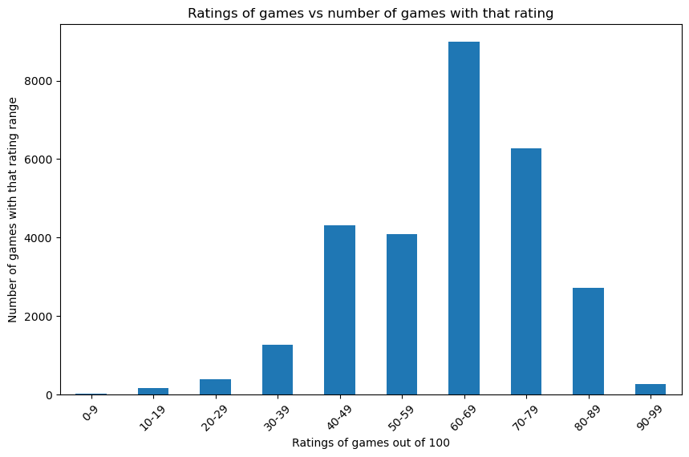

This data suggests that people on the IGDB website tend to rate games following something similar to a normal distribution, where most games get rated 60-69, and the least games are rated 0-9 or 90-99.

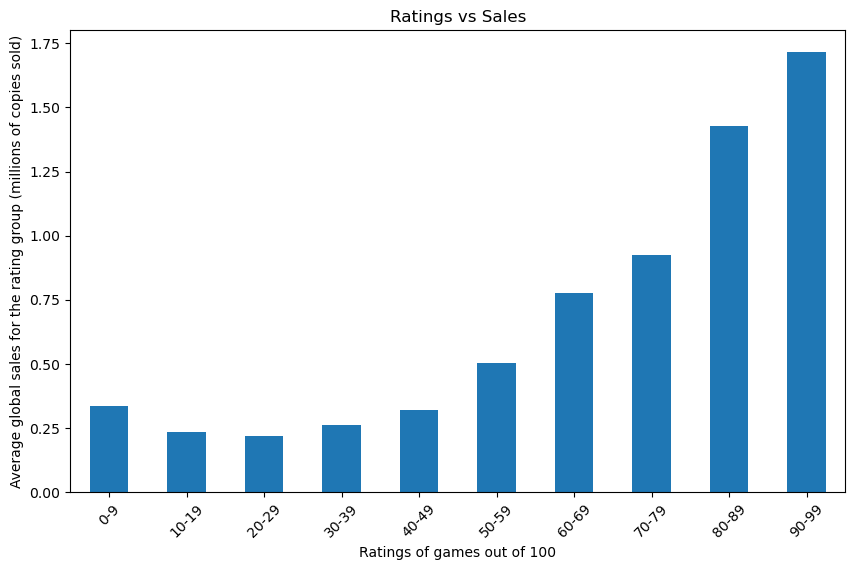

Our research concluded that there is a correlation between ratings and sales. It is a positive correlation of 0.153, indicating that as ratings increase, sales also increase. 

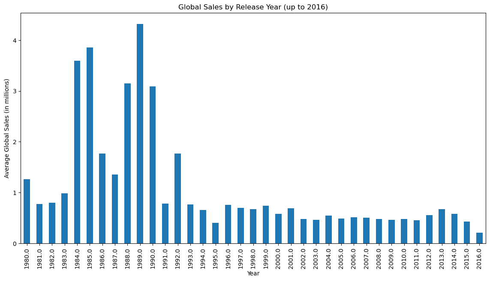

There is little to no correlation between the year and average sales of games. The correlation coefficient was ~ -0.07

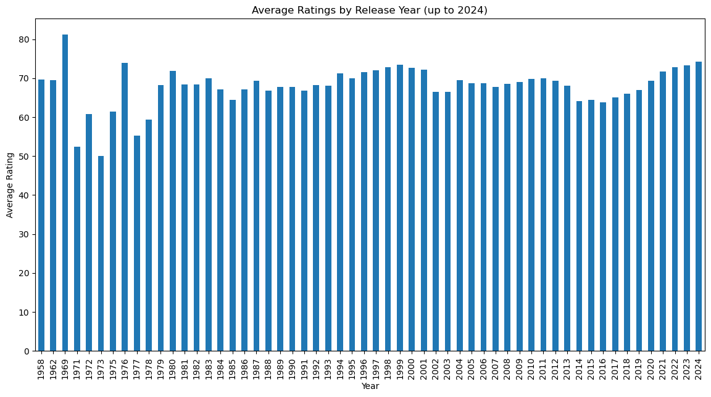

There is little to no correlation between the year and people's average rating of games. The correlation coefficient was ~ -0.07

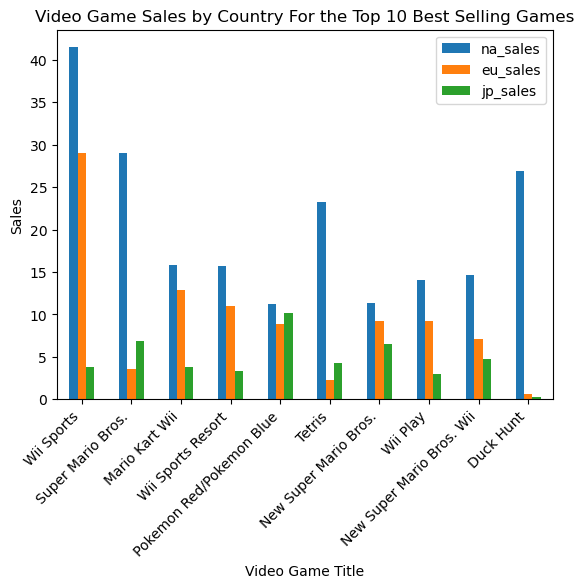

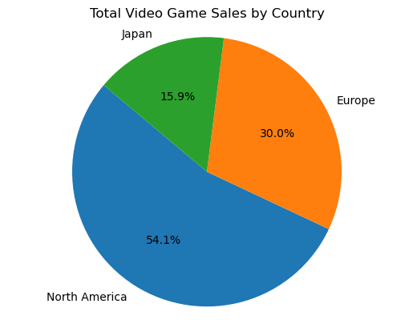

These visualizations clearly show that the North America region is leading the world in sales, both for individual games, and as a sum.

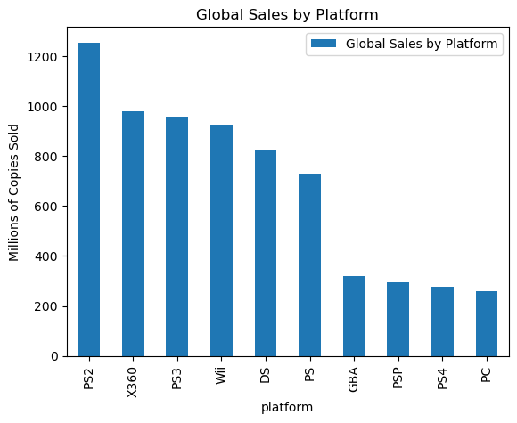

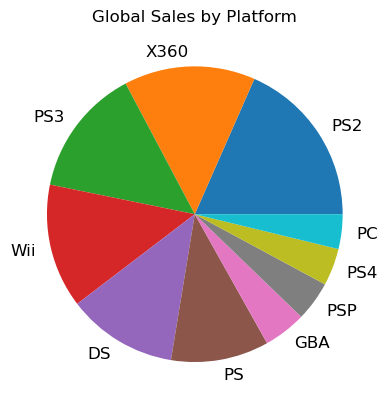

The PlayStation 2 sold the most games globally, with over 1,200,000,000 (1.2 Billion) games sold for the system.

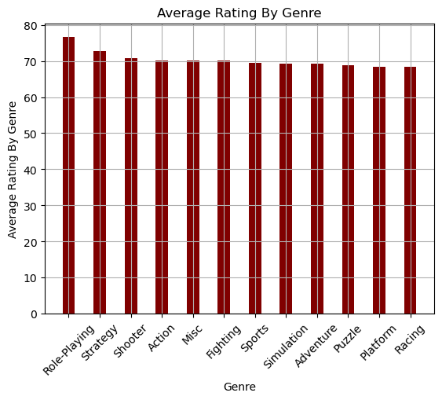

There is little to no correlation between ratings and genre, with role-playing games being rated a tiny bit higher on average

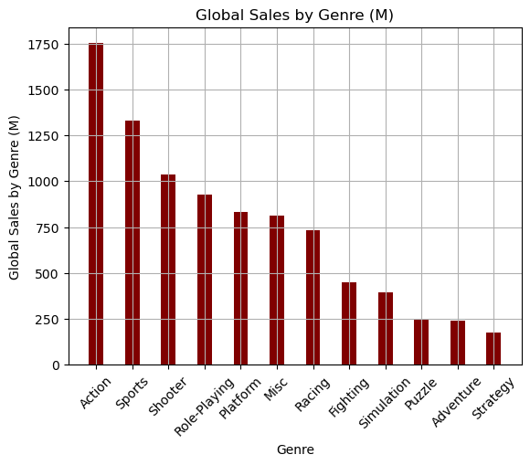

It appears that games in the action genre have higher sales than games in other genres

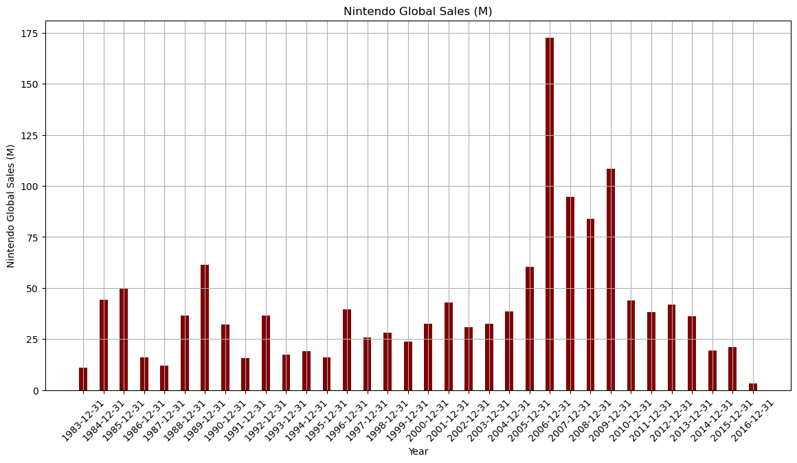

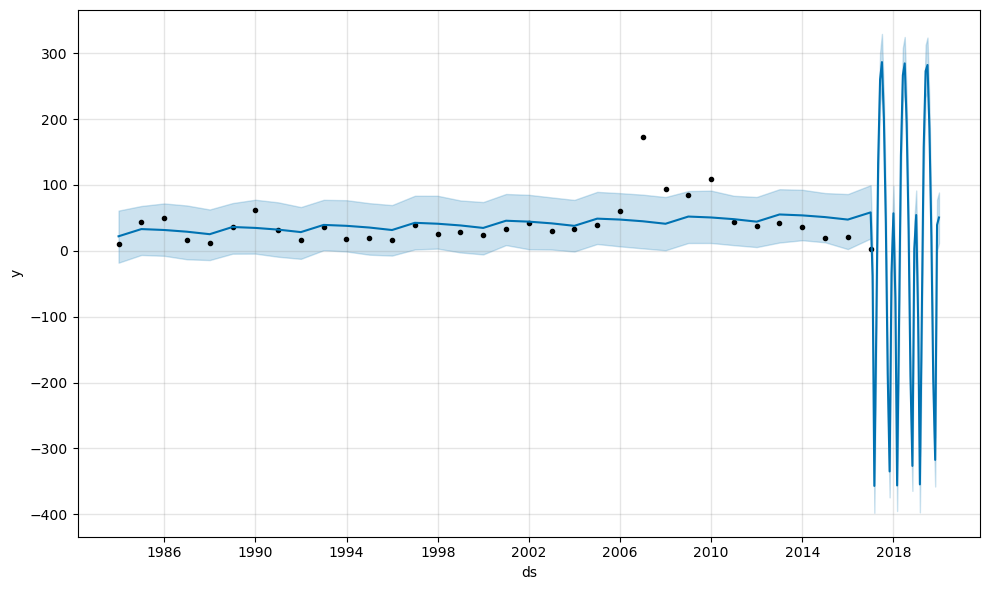

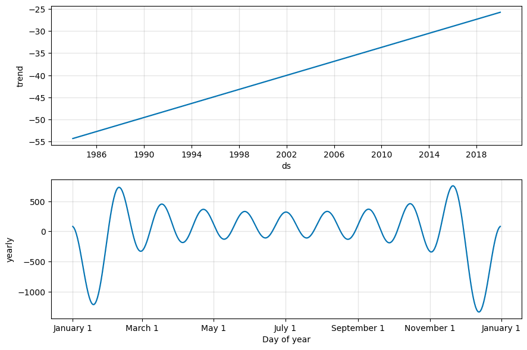