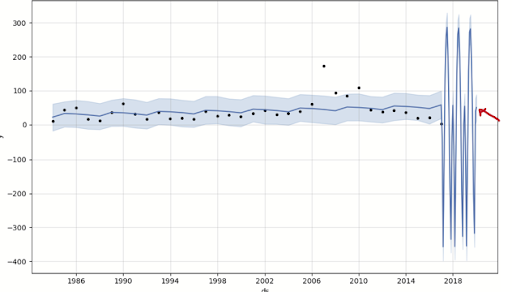

# Video Gaming Industry Analysis

### Presentation Group 2 [Video Games Insights (https://bitly.ws/3ihXh)

The video gaming industry, is the selected industry for our project.  Specifically, the games that are played on or via the internet.  Rating statistics are captured and maintained 
within a database managed by Twitch, an Amazon Company.  Per Wikipedia, "Twitch is an American video live-streaming service that focuses on video game live streaming, including broadcasts of esports competitions, in addition to offering music broadcasts, creative content, and "in real life" streams. Twitch is operated by Twitch Interactive, a subsidiary of Amazon[4] It was introduced in June 2011 as a spin-off of the general-interest streaming platform Justin.tv.[5] Content on the site can be viewed either live or via video on demand. The games shown on Twitch's current homepage are listed according to audience preference and include genres such as real-time strategy games (RTS), fighting games, racing games, and first-person shooters." (https://en.wikipedia.org/wiki/Twitch_(service)).

The database (one of two for this project), that we are using is the Internet Games Database, IGDB. Per Wikipedia, "Twitch acquired the Internet Games Database (IGDb), a user-driven website similar in functionality to Internet Movie Database (IMDb) to catalog details of video games in September 2019. Twitch plans to use the database service to improve its own internal search features and help users find games they are interested in.[73] On September 26, 2019, Twitch unveiled a new logo and updated site design. The design is accompanied by a new advertising campaign, "You're already one of us", which will seek to promote the platform's community members.[74] Twitch began signing exclusivity deals with high-profile streamers in December 2019."  The url of the IGDB is https://www.igdb.com/ .  

The second, or other database we plan to use is Kaggle based, and is "Video Games Sales", url https://www.kaggle.com/datasets/gregorut/videogamesales. This came to us somewhat of an after thought, as we wanted to include sales information in addition to the ratings data we get from the IMDb. 

# Video Gaming Industry Analysis

## Overview

This project delves into the video gaming industry, focusing on online games and utilizing data from Twitch, the Internet Games Database (IGDB), and a Kaggle dataset on video game sales. The analysis aims to uncover insights regarding top-rated games, genres, platforms, and sales trends, facilitating informed decision-making for game development.

## Questions

1. What are the highest-rated games overall and by genre?
2. Which gaming platforms are most popular?
3. Which games have the highest sales, and how does sales data correlate with ratings?
4. What are the regional trends in game sales?

## Data Collection and Exploration

- Data gathered from [Twitch](https://www.twitch.tv/), [Kaggle](https://www.kaggle.com/), and [IGDB](https://www.igdb.com/) APIs.
- Removed null values, duplicates, and irrelevant columns.
- Merged ratings and sales data for comprehensive analysis.

## Approach

- Conducted thorough research to identify relevant data sources.
- Utilized visualization techniques to interpret and analyze data patterns.

## Limitations

- Limited sales data availability (up to 2017) and coverage of companies.
- Challenges in cleaning and standardizing ratings data.

## Future Considerations

- **Analysis of Pandemic-Era Sales**: Future analysis could explore video game sales data during the pandemic years to understand the impact of global events on gaming trends and consumer behavior.

---

Incorporating future considerations, such as analyzing video game sales during the pandemic, adds depth to our understanding of the industry's dynamics and evolution over time.

## Executive Summary (https://docs.google.com/document/d/1L0A56Tv1IbdLR3lgkLg1lOgp9rtj5ouT/edit) 

## Sources

- Kaggle
- Twitch
- IGDB

## Conclusion

### Question: Does ratings data impact sales?

This data suggests that people on the IGDB website tend to rate games following something similar to a normal distribution, where most games get rated 60-69, and the least games are rated 0-9 or 90-99.

Our research concluded that there is a correlation between ratings and sales. It is a positive correlation of 0.153, indicating that as ratings increase, sales also increase. 

### Question: Does the year impact sales?

There is little to no correlation between the year and average sales of games. The correlation coefficient was ~ -0.07

### Question: Does the year impact ratings?

There is little to no correlation between the year and people's average rating of games. The correlation coefficient was ~ -0.07

### Question: How are video game sales distributed by region?

These visualizations clearly show that the North America region is leading the world in sales, both for individual games, and as a sum.

### Question: Which platform had the most video game sales? 

- The PlayStation 2 sold the most games globally, with over 1,200,000,000 (1.2 Billion) games sold for the system. 

The dominant factors that impact global sales of platform are:
- The Rise of the 6th Generation (PS2, Xbox 360, Gamecube): This era (roughly 2000-2007) offered a significant leap in graphics and processing power compared to prior consoles.
- The PS2 Phenomenon: PS2's affordability, vast game library, DVD playback capabilities, and backward compatibility made it a juggernaut, attracting a wide range of gamers.
- Nintendo's Casual Appeal: The Wii (released in 2006) brought innovative motion controls and family-friendly games to the market and tapping a new market segment. 
- Handheld Success: The Nintendo DS (released in 2004) offered a powerful handheld gaming experience with dual screens and touch functionality. 

### Question: What games by genre are rated the best?

- The approach taken to answer this question, was to categorize all games by genre.  The data used to do the categorization, was obtained via the combined sales and rating database.  The sales and rating information was combined by performing a match by game, which dropped anything from the rating database if a match wasn’t obtained via sales.  Therefore, this kept both the sales and rating information relevant and comparable by the game(s), but reduce the rating information as a whole.
- As mentioned, games were categorized by genre by performing a “group by genre” and then sorting this by either the average aggregate rating or global aggregate sales.  Neither of these were grouped by year, but rather depicted on an aggregate scale encompassing the entire sales data available.  Below is a graph depicting the ratings information by genre….

- This graph encompasses all genres, and as can be seen, the top-rated genre and the games within, were those related to the Role-Playing genre.  The least rated, although still high, were those in the Racing genre.  They ranged from a low of 68.4 to a high of 76.6.  

- Comparing the above(ratings) to sales, it became quite apparent that using a genre comparison to find any correlation between rating and sales was nil.  For instance, the “Strategy” genre, came in second highest in ratings, but the lowest in sales.  Below is the graph depicting genres by sales.

- Sales represent the number of, not any revenue.  Through our searches, it appears companies are not that easy with sharing revenue information, and understandably so.  

- Although depicting the genre information was interesting, it didn’t contribute much to our story in determining ratings impact to sales, but it did answer specific genre information.  Moving on, and considering that Module 8 had focused on forecasting, the decision to pursue information along these lines became intriguing.  Nothing in our original questions dealt with this aspect, so this became an add-on.  

### Question: What publisher had the most sales, and can Prophet predict it's sales going forward?

- From this, Prophet and the means to forecast future sales became this next focus.  However, would the data support such?   To answer this, first the company had to be identified.  The sales database indeed had publisher information and, it could be grouped just like the genre data.  Grouping and sorting by the publisher sales data from an aggregate (entire sales data cache) perspective, provided the company – Nintendo. Identifying Nintendo, the data was spread out by the only approximation of a date – a 4-digit year.  Hence the graph below was produced depicting the yearly sales data for Nintendo.

- However, that four-digit date (1983 through 2016) to serve as the only data point for a particular year, proved to be problematic.  First, it had to be turned into a formatted date, as Prophet did not recognize the year by itself.  Prophet, when dealing with the year as the date, started from 1970, which was learned to be the start of any forecast by default for Prophet, and could not be used as is. Therefore, a straight date conversion cell was created to change the year to xxxx-12-31 as shown above in the graph.  This conversion was rather crude and should have been created more elegantly, as perhaps a list-based methodology, but time was short and this had to be proved doable first.  Prophet, also learned, did not support a prediction based on year when creating the periods, in which Prophet is to base its prediction on.  A quarterly period was attempted, and worked, but a monthly period based on thirty-six (36) months, or three years out was ultimately selected.  The graph below portrays the results from Prophet.

- As can be seen, the first part of the graph is easily understood.  Each dot represents one of the yearly data points.  The forecasted sections get a bit wild.  To decipher, referencing the Prophet Data frame Trend Report was needed.  The YHAT values for EOY were in and around 50, and essentially reflects what the data fed to the model portrays, by most of the yearly plots through the graph on the left.  The red arrow (in the graph) shows the YHAT value for each year going right to left.  The wide swings however, should be ignored as this probably indicates the issue of not having any data to use throughout any of the years that are being modelled.      

